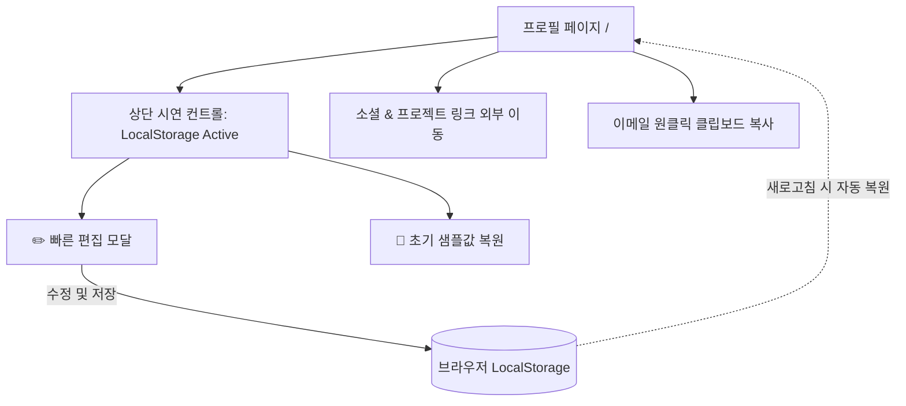

# 📋 [PRD] 개발자 특화 링크인바이오 서비스: 마이링크 (MyLink)

- **문서 버전**: v1.5.0 (TDS 스타일 링크 더미 데이터셋 스펙 추가)
- **최종 수정일**: 2026년 9월 25일
- **작성 상태**: 승인 완료 (Approved)
- **대상 프로덕트**: MyLink (링크트리 클론 서비스)

---

## 1. 제품 개요 (Product Overview)

### 1.1 배경 및 문제 정의 (Problem Statement)
- **개발자의 분산된 아이덴티티**: 현대의 개발자는 GitHub, 개인 기술 블로그(Velog, Tistory, Medium), 포트폴리오 사이트, LinkedIn, SNS(X, Threads), 커뮤니티 등 수많은 채널에 흩어져 활동합니다.
- **기존 링크트리(Linktree)의 한계**: 기존 범용 링크트리는 텍스트 링크 나열에 치중되어 있어, 개발자의 핵심 정체성인 **기술 스택(Tech Stack), GitHub 활동 내역, 프로젝트 쇼케이스**를 전문적으로 보여주기에 부족합니다.
- **점진적 시연 및 검증의 필요성**: 백엔드와 대시보드를 한 번에 구축하기보다, **시연(Demo) 및 빠른 사용자 반응 검증을 위해 1단계로 로컬 스토리지 기반 프로필 페이지를 완성한 후 멀티테넌트 SaaS로 단계별 확장**합니다.

### 1.2 제품 비전 (Product Vision)
> **"단 1분의 GitHub 연동으로 완성되는 가장 세련된 개발자 전용 링크인바이오"**  
> 마이링크(MyLink)는 개발자와 IT 인재가 자신의 기술 역량과 활동 링크를 한눈에 증명하고 매력적으로 공유할 수 있는 서비스입니다.

---

## 2. 점진적 릴리즈 전략 (Staged Release Strategy)

| 단계 | 범위 및 목표 | 데이터 저장소 | 핵심 특징 | 상태 |
| :--- | :--- | :--- | :--- | :---: |
| **Phase 0 (Demo)** | **로컬 스토리지 기반 프로필 페이지** | Browser `localStorage` | • 복잡한 대시보드/통계 없이 프로필 페이지만 집중<br>• Zustand Persist 기반 자동 영속화<br>• 시연용 인페이지 빠른 편집 모달 & 초기화 | **완료 (Live)** |
| **Phase 1 (MVP)** | **멀티테넌트 SaaS 확장** | Supabase (PostgreSQL) | • GitHub OAuth 소셜 로그인 & 고유 핸들 `/[username]`<br>• 좌측 에디터 + 우측 모바일 프리뷰 분할 대시보드<br>• 페이지뷰(PV) 및 링크별 클릭수 기본 통계 | 진행 예정 |
| **Phase 2 (Pro)** | **수익화 & 고급 도구** | PostgreSQL + Payment | • 커스텀 도메인(CNAME) 연결<br>• 유입 경로(Referrer) 및 디바이스 심층 분석<br>• 잔디 그래프 임베드 & Pro 테마팩 | 로드맵 |

---

## 3. 타겟 페르소나 및 핵심 가치 제안

### 3.1 주요 타겟 사용자 (Target Personas)
1. **주니어 ~ 시니어 소프트웨어 엔지니어**: 이력서, 커피챗, 이메일 서명, SNS 프로필에 명함처럼 첨부할 간결하고 임팩트 있는 링크 페이지가 필요한 개발자
2. **IT 크리에이터 / 테크 인플루언서**: 유튜브, 뉴스레터, 기술 블로그를 운영하며 개발 관련 콘텐츠와 사이드 프로젝트를 큐레이션하려는 크리에이터
3. **채용 담당자 및 동료 개발자(방문자)**: 지원자/동료의 기술 스택, 깃허브 코드, 대표 프로젝트를 한 페이지에서 빠르게 탐색하고자 하는 사용자

### 3.2 핵심 가치 제안 (Value Proposition)
- **개발자 아이덴티티 극대화**: GitHub 아바타/활동 상태, 기술 스택 뱃지, 프로젝트/블로그 하이라이트 카드 제공
- **즉각적인 데이터 영속성**: 별도 가입 절차 없이도 로컬 스토리지(Phase 0) 및 클라우드(Phase 1)를 통한 즉각적인 편집 및 보존
- **shadcn/ui 기반 토스 디자인 시스템(TDS) 스타일 표준화**: 공식 shadcn/ui 프리미티브의 접근성·안정성 위에 **토스 디자인 시스템(TDS)** 특유의 극도의 심플함, 시그니처 토스 블루(`Toss Blue #3182F6`), 부드러운 라운딩(`rounded-2xl`~`rounded-3xl`), 절제된 소프트 그림자 및 경쾌한 햅틱 마이크로 인터랙션을 입혀 개발자 링크인바이오 사상 가장 직관적이고 유려한 UX 제공
- **가벼운 확장성**: 단일 프로필 페이지에서 향후 SaaS 대시보드로 매끄럽게 확장 가능한 컴포넌트 구조

---

## 4. 사용자 시나리오 (User Scenarios)

### 📌 시나리오 1: 이력서/커피챗 링크가 필요한 구직 개발자 '민수'
- **페르소나**: 3개월 차 취업 준비 프론트엔드 개발자 (GitHub, Velog 블로그 운영)
- **상황/목표**: 이력서와 포트폴리오 PDF 상단에 GitHub 코드, 블로그 기술 글, 배포 프로젝트를 깔끔하게 한 페이지로 묶어 채용 담당자에게 전달하고 싶음.
- **주요 여정(Journey)**:
  1. 마이링크에 접속하여 상단 **`✏️ 프로필 편집`** 클릭.
  2. 이름, 영문명, "Frontend Developer" 직군 뱃지 및 한 줄 슬로건("사용자 경험에 집착하는 엔지니어") 입력.
  3. GitHub 리포지토리, Velog 기술 블로그, 대표 토이 프로젝트 배포 URL을 링크 카드로 등록하고, 대표 프로젝트에 `HIGHLIGHT ★` 뱃지 부여.
  4. **`[💾 변경사항 저장]`**을 클릭하여 로컬 스토리지에 저장 완료 (새로고침해도 보존 확인).
  5. 하단 이메일 복사 기능을 테스트해 본 뒤, 본인의 공식 포트폴리오 링크로 활용.
- **체감 가치**: 무거운 노션 페이지나 별도 포트폴리오 사이트 코딩 없이, 3분 만에 모바일 최적화된 트렌디한 개발자 링크 페이지 완성.

---

### 📌 시나리오 2: 분산된 활동을 한곳에 큐레이션하는 시니어 엔지니어/크리에이터 '지현'
- **페르소나**: 7년 차 풀스택 엔지니어이자 테크 유튜브/기술 서적 집필 크리에이터
- **상황/목표**: 유튜브 채널, 출간 서적 구매 링크, 오픈소스 기여 내역, 테크 블로그 링크가 소셜 미디어마다 흩어져 있어 팔로워 및 협업 제안자에게 단일 허브를 제공하고 싶음.
- **주요 여정(Journey)**:
  1. 프로필 상단 상태 뱃지를 "오픈소스 기여 & 기술 자문 환영 🚀"으로 설정.
  2. About Me 섹션에 자신의 아키텍처 철학과 엔지니어링 마인드셋을 라벨별로 정리.
  3. 7가지 핵심 기술 스택(TypeScript, React, Node.js, Docker 등)을 뱃지로 등록.
  4. 링크 카드를 중요도 순으로 배치: 최상단에 [신간 도서 구매 링크], [YouTube 채널 바로가기], [GitHub 프로필] 순으로 정렬.
  5. *(Phase 1 확장 시)*: 대시보드 통계를 통해 팔로워들이 어떤 링크를 가장 많이 클릭하는지 주간 추이 차트 확인.
- **체감 가치**: 자신의 모든 기술적 커리어와 콘텐츠를 전문성 있는 단일 브랜드 페이지로 구축하여 퍼스널 브랜딩 극대화.

---

### 📌 시나리오 3: 30초 안에 지원자의 역량을 훑어보는 테크 리크루터 '성훈'
- **페르소나**: IT 스타트업의 개발 직군 채용 담당자 (하루 50개 이상의 지원서 검토)
- **상황/목표**: 긴 지원서나 로딩이 느린 포트폴리오 사이트 대신, 지원자의 핵심 기술 스택과 실제 깃허브 코드/결과물을 모바일에서 빠르게 검증하고 싶음.
- **주요 여정(Journey)**:
  1. 지원자의 서류에서 `mylink.io/[username]` 링크를 모바일로 탭하여 접속.
  2. 1초 미만의 빠른 로딩(LCP < 1.2s)으로 첫인상 확인.
  3. 지원자의 온라인 상태, 핵심 기술 스택 태그(TypeScript, Next.js 등)를 스캔하여 직무 적합성 즉각 파악.
  4. `HIGHLIGHT ★` 뱃지가 달린 대표 프로젝트 카드를 탭하여 실제 구동 웹앱 및 GitHub 코드 확인.
  5. 적합한 인재라 판단하여, 프로필 하단의 **`[이메일 복사하기]`** 버튼을 원클릭으로 눌러 즉시 면접 제안 메일 발송.
- **체감 가치**: 탐색 피로도 없이 지원자의 정체성과 주요 링크를 30초 만에 완벽히 스캐닝 가능.

---

### 📌 시나리오 4: 마이링크 기능을 청중에게 선보이는 시연자 '채규' (Live Demo)
- **페르소나**: 프로젝트 발표 및 시연을 진행하는 마이링크 개발자
- **상황/목표**: 심사위원 및 청중 앞에서 복잡한 서버/DB 설정 없이도 안정적으로 마이링크의 핵심 가치와 데이터 영속성을 효과적으로 증명하고 싶음.
- **주요 여정(Journey)**:
  1. 브라우저로 `localhost:3000`에 접속하여 네오브루탈리즘 스타일의 완성도 높은 프로필 UI 소개.
  2. 상단의 `LOCALSTORAGE ACTIVE` 인디케이터를 가리키며 무서버 클라이언트 영속화 아키텍처 설명.
  3. **`✏️ 프로필 편집`** 모달을 열고, 청중이 보는 앞에서 이름을 "홍길동", 슬로건을 "라이브 시연 중입니다!"로 바꾸고 새로운 링크를 즉석 등록 후 저장.
  4. 브라우저 강력 새로고침(F5)을 눌러도 데이터가 사라지지 않고 그대로 보존됨을 시연.
  5. 시연 종료 후 **`🔄 초기화`** 버튼을 눌러 1초 만에 초기 개발자 샘플 상태로 원상복구.
- **체감 가치**: 네트워크 장애나 백엔드 의존성 없이 100% 신뢰할 수 있는 인터랙티브 라이브 데모 수행.

---

## 5. 정보 구조 및 사용자 흐름 (IA & User Flow)

### 5.1 Phase 0 (현재 시연 구조)


### 5.2 Phase 1 (멀티테넌트 SaaS 구조)
```mermaid
flowchart TD
    A1[랜딩 페이지 /] --> B1{로그인 여부}
    B1 -->|비로그인| C1[GitHub / Google 소셜 로그인]
    B1 -->|로그인| D1[대시보드 /dashboard]
    
    C1 --> E1[온보딩: 고유 핸들 /[username] 설정]
    E1 --> D1

    subgraph "관리자 대시보드 (/dashboard)"
        D1 --> F1[프로필 & 바이오 설정]
        D1 --> G1[기술 스택 뱃지 관리]
        D1 --> H1[링크 카드 관리 & DnD 정렬]
        D1 --> I1[테마 & 컬러 스타일링]
        D1 --> J1[통계 차트 (PV / 클릭수)]
        F1 & G1 & H1 & I1 -.->|실시간 동기화| K1[우측 실시간 모바일 프리뷰]
    end

    L1[방문자] --> M1[공개 프로필 페이지 /[username]]
    M1 -->|PV 및 클릭 이벤트| N1[(Supabase DB)]
```

---

## 6. 상세 기능 요구사항 (Functional Requirements)

### 6.1 [Phase 0] 프로필 페이지 & 로컬 스토리지 (현재 구현 완료)
- **FR-0.1 (로컬 스토리지 영속화)**:
  - Zustand `persist` 미들웨어를 통해 `mylink_profile_storage` 키에 프로필 데이터를 실시간 영속화.
  - 브라우저 새로고침(F5) 또는 재접속 시에도 수정된 데이터가 100% 보존.
  - SSR Hydration Mismatch 방지 마운트 가드 적용.
- **FR-0.2 (프로필 뷰어)**:
  - 아바타 이미지, 온라인 상태 뱃지, 한/영 이름, 포지션 뱃지, GitHub 링크 뱃지, 한 줄 슬로건.
  - About Me 섹션 (Frontend, Backend, Mindset 등 라벨/설명 카드).
  - 7개 핵심 기술 스택 태그 렌더링.
  - 링크 카드 목록 (제목, 설명, 뱃지, 테마 배경색, 화살표 호버 인터랙션).
  - 이메일 원클릭 클립보드 복사 및 토스트 피드백.
- **FR-0.3 (시연용 인페이지 빠른 편집 모달)**:
  - 상단 컨트롤 바에서 `✏️ 프로필 편집` 클릭 시 모달 호출.
  - 이름, 영문명, 직함, 상태 뱃지, 슬로건, 이메일, GitHub 핸들 수정 기능.
  - 새 링크 카드 추가 (제목, URL, 설명, 카드 테마색 선택).
  - 기존 링크 카드 목록 조회 및 즉시 삭제.
- **FR-0.4 (원클릭 초기화)**:
  - `🔄 초기화` 버튼을 통해 언제든 초기 샘플 프로필(`initialProfileData`)로 롤백.
- **FR-0.5 (시연 및 테스트용 링크 더미 데이터셋 활용)**:
  - 개발자 페르소나에 최적화된 표준 더미 데이터셋([`src/data/mockLinks.ts`](file:///c:/Users/SHIN%20CHAE%20GYU/Desktop/my-link-hy/src/data/mockLinks.ts))을 시연 및 초기 데이터로 활용.
  - **더미 데이터 필수 요건**: 각 링크 항목은 고유 식별자(**`id`**), 노출 제목(**`title`**), 이동 경로 링크(**`url`**)를 반드시 필수로 포함해야 함.
  - 부가 메타데이터: TDS 스타일에 맞춘 설명(`description`), 아이콘(`icon`), 상태 뱃지(`badge`), 카드 배경색(`cardColor`), 뱃지 색상(`badgeColor`) 등을 함께 구성.

### 6.2 [Phase 1] 멀티테넌트 SaaS & 대시보드 (다음 단계 예정)
- **FR-1.1 (인증 & 고유 핸들)**: Supabase Auth 기반 GitHub OAuth 로그인 및 `/[username]` 경로 점유.
- **FR-1.2 (분할 화면 대시보드 `/dashboard`)**:
  - 좌측 설정 탭 폼 + 우측 반응형 모바일 실시간 프리뷰.
  - 드래그 앤 드롭(DnD) 링크 카드 상하 순서 재배치.
- **FR-1.3 (통계 및 분석)**:
  - 프로필 페이지 유효 PV 집계.
  - 링크 카드별 클릭수 집계 및 주간/월간 추이 차트.
- **FR-1.4 (동적 SEO & OG 태그)**:
  - 사용자별 맞춤 OpenGraph 카드 동적 생성 (`@vercel/og`).

---

## 7. 기술 스택 및 시스템 아키텍처 (Tech Stack & Architecture)

| **Styling & Engine** | **Tailwind CSS v4 (CSS-First, 전용)** | **모든 스타일링은 CSS 모듈(`.module.css`) 없이 Tailwind CSS 유틸리티 클래스만 사용**. 별도 JS config 없는 `@theme` 기반 최신 엔진, 고성능 스타일 번들링 |
| **Design System** | **shadcn/ui + Toss Design System (TDS)** | **모든 신규 UI/컴포넌트 설계의 공식 기반**. shadcn/ui의 접근성·컴포넌트 아키텍처 위에 토스 특유의 미니멀하고 유려한 TDS 비주얼 언어 결합. **재사용 컴포넌트는 `src/components/ui/`에 배치** |
| **전역 상태 & 영속화** | **`Zustand` (Persist)** | • **Phase 0**: Browser `localStorage`와 바인딩하여 무서버 즉각 영속화<br>• **Phase 1**: 에디터 폼 ↔ 실시간 프리뷰 동기화 및 Dirty Check 관리 |
| **Backend & Database** | Supabase (PostgreSQL) *(Phase 1)* | GitHub OAuth 인증, Row Level Security(RLS), 통계 테이블 및 이미지 Storage |
| **Deployment** | Vercel | 글로벌 엣지 네트워크 CDN 캐싱 및 빠른 배포 |

### 7.1 토스 디자인 시스템(TDS) 기반 디자인 구현 원칙
향후 모든 UI 컴포넌트와 화면(프로필 뷰어, 편집 모달, SaaS 대시보드, 폼 등)은 **shadcn/ui 프리미티브를 베이스로 하되, 토스 디자인 시스템(TDS)의 시각적·상호작용적 문법을 충실히 반영**하여 구축합니다.

> **[필수 규칙] Tailwind CSS 전용 스타일링**: CSS 모듈(`.module.css`), 인라인 `style` 속성(동적 값 제외), 별도 CSS 파일 사용 금지. 모든 스타일링은 **Tailwind CSS 유틸리티 클래스 + `cn(...)` 유틸리티**로만 구현합니다.

1. **컬러 시스템 (TDS Color Palette)**:
   - **Toss Blue (`#3182F6`)**: 단 하나의 명확하고 직관적인 메인 브랜드/CTA 인터랙티브 컬러 (`--primary`).
   - **Surface & Background**: 배경은 편안한 라이트 그레이 계열(`--background: #F9FAFB` 또는 `#F2F4F6`), 카드는 시각적으로 명확히 분리되는 순백색(`--card: #FFFFFF`).
   - **타이포그래피 톤앤매너**: 가독성을 극대화한 4단계 텍스트 계층 — Title (`#191F28`), Body (`#333D4B`), Muted/Caption (`#6B7684`), Sub/Disabled (`#8B95A1`).
2. **형태 및 라운딩 (Shape & Radius)**:
   - 토스 특유의 넉넉하고 부드러운 코너 곡률 표준화:
     - 뱃지/소형 칩: `rounded-lg` (8px ~ 10px)
     - 버튼/입력 필드: `rounded-2xl` (16px) 또는 시그니처 알약형 `rounded-full` (Pill)
     - 링크 카드/모달 컨테이너: 넉넉한 여백과 일체화된 `rounded-3xl` (20px ~ 24px)
3. **마이크로 인터랙션 & 피드백 (Micro-interactions)**:
   - **Haptic-like Scale**: 버튼 및 클릭 가능한 링크 카드 탭/클릭 시 `active:scale-[0.97]` 또는 `active:scale-[0.96]`의 부드러운 수축-복원 애니메이션 제공.
   - **부드러운 전환 (Smooth Transition)**: `transition-all duration-200 ease-out` 기반의 반응성.
4. **절제된 엘리베이션 (Elevation & Depth)**:
   - 하드한 네오브루탈리즘 외곽선 대신, 은은한 배경색 대비와 부드러운 소프트 섀도우(`shadow-sm`, `shadow-md`, `rgba(0, 0, 0, 0.04)`)로 자연스러운 레이어 깊이감 형성.
5. **shadcn/ui 컴포넌트 거버넌스**:
   - `Button`: 토스 블루 Primary 버튼, 은은한 배경의 Soft Secondary 버튼, 테두리 없는 깔끔한 Ghost 버튼.
   - `Dialog / Sheet`: 모바일 환경에 최적화된 토스 스타일의 바텀시트(Bottom Sheet) 인터랙션 및 부드러운 슬라이드업 모달.
   - `Input / Switch / Tabs`: 불필요한 장식을 배제하고 입력 완료 상태와 포커스 상태를 토스 블루로 정밀하게 안내하는 고감도 폼 컴포넌트.
   - **링크 목록 페이지(`/links`) 재사용 컴포넌트 레지스트리** (`src/components/ui/`):

     | 파일 | 컴포넌트 | 역할 |
     | :--- | :--- | :--- |
     | `badge.tsx` | `Badge`, `CountBadge` | TDS 스타일 뱃지/링크 수 칩 |
     | `link-icon.tsx` | `LinkIcon` | 링크 카테고리별 아이콘 렌더러 |
     | `search-input.tsx` | `SearchInput` | Toss Blue 포커스 Pill 검색 인풋 |
     | `category-filter.tsx` | `CategoryFilter` | 알약형 카테고리 필터 세그먼트 |
     | `link-card-item.tsx` | `LinkCardItem`, `LinkListEmpty` | 링크 카드 + Empty State |
     | `link-page-header.tsx` | `LinkPageHeader` | 프로필 요약 헤더 카드 |
     | `share-card.tsx` | `ShareCard` | 페이지 URL 공유 카드 |

   - 모든 스타일링은 [src/app/globals.css](file:///c:/Users/SHIN%20CHAE%20GYU/Desktop/my-link-hy/src/app/globals.css)의 `@theme inline` 토큰 및 [`cn(...)`](file:///c:/Users/SHIN%20CHAE%20GYU/Desktop/my-link-hy/src/lib/utils.ts) 유틸리티를 통해 구현.

---

## 8. 데이터 모델 (Data Model)

### 8.1 Phase 0: Client State (TypeScript Schema)
```typescript
interface ProfileData {
  username: string;
  name: string;
  englishName?: string;
  githubUsername?: string;
  email?: string;
  avatarUrl: string;
  role: string;
  status: string;
  headline: string;
  bioSections: BioSection[];
  techStack: TechStack[];
  links: LinkCard[];
  themeConfig: ThemeConfig;
}
```

#### 8.1.1 링크 카드(`LinkCard`) 모델 및 더미 데이터 명세
링크 목록에 사용하는 더미 데이터는 [`src/data/mockLinks.ts`](file:///c:/Users/SHIN%20CHAE%20GYU/Desktop/my-link-hy/src/data/mockLinks.ts)를 표준으로 하며, **아이디(`id`), 타이틀(`title`), 링크(`url`)** 3개 필드가 필수(Required)로 제공되어야 합니다.

```typescript
export interface LinkCard {
  id: string;          // [필수] 고유 식별자 (예: 'link-featured-1')
  title: string;       // [필수] 링크 카드 타이틀 (예: 'MyLink — Developer Link-in-Bio')
  url: string;         // [필수] 이동할 웹 링크 대상 URL (예: 'https://github.com/shinpower1/mylink')
  description: string; // [선택] 링크 부가 설명
  icon: string;        // [선택] 아이콘 식별자 (github, portfolio, blog, presentation 등)
  badge?: string;      // [선택] 상태/강조 뱃지 텍스트 ('FEATURED 🚀', 'HIGHLIGHT ★' 등)
  cardColor?: string;  // [선택] TDS 테마 배경색 클래스 (예: 'bg-[#E8F3FF]')
  badgeColor?: string; // [선택] 뱃지 색상 클래스 (예: 'bg-[#3182F6] text-white')
  isActive?: boolean;  // [선택] 활성화 여부 (기본값: true)
  orderIndex?: number; // [선택] 정렬 순서
}
```

##### 📌 표준 더미 링크 데이터셋 구성 (`mockLinks` 8종)
1. **`link-featured-1`**: `MyLink — Developer Link-in-Bio` (`url`: github repo) — 대표 프로젝트
2. **`link-featured-2`**: `GitHub Profile & Open Source` (`url`: github profile) — 코드 리포지토리
3. **`link-writing-1`**: `React 19 & Next.js 16 렌더링 최적화 탐구` (`url`: tech blog) — 기술 블로그 글
4. **`link-talk-1`**: `토스 테크 세미나: 마이크로 프론트엔드 전환기` (`url`: slides) — 컨퍼런스 발표 자료
5. **`link-oss-1`**: `TDS-Kit (토스 스타일 컴포넌트 라이브러리)` (`url`: oss repo) — 오픈소스 프로젝트
6. **`link-career-1`**: `LinkedIn Career & Professional Resume` (`url`: linkedin) — 커리어 이력서
7. **`link-contact-1`**: `커피챗 & 커리어 멘토링 신청` (`url`: calendly) — 30분 커피챗 예약
8. **`link-contact-2`**: `비즈니스 협업 및 프로젝트 문의` (`url`: mailto) — 이메일 문의

### 8.2 Phase 1: PostgreSQL Relational Schema (Supabase)
- `profiles`: id, username, name, english_name, role, status, headline, avatar_url, theme_config
- `bio_sections`: id, profile_id, label, description, color, order_index
- `tech_stacks`: id, profile_id, name, color, order_index
- `links`: id, profile_id, title, description, url, icon, badge, card_color, is_active, order_index
- `analytics_events`: id, profile_id, link_id, event_type, referrer, user_agent, created_at

---

## 9. 단계별 개발 로드맵 (Milestones & Roadmap)

```
[ Phase 0: Demo / Local Storage ] ──► [ Phase 1: MVP Full-Stack SaaS ] ──► [ Phase 2: Pro & Scale ]
• 로컬 스토리지 프로필 페이지 (완료)    • Supabase Auth (GitHub OAuth)       • 나만의 커스텀 도메인(CNAME)
• Zustand Persist 자동 저장 (완료)     • /[username] 동적 라우팅            • 유입 경로/기기별 심층 분석
• 빠른 편집 모달 & 원클릭 리셋 (완료)  • 분할 대시보드 (/dashboard) + DnD   • 깃허브 잔디/고정 저장소 위젯
                                       • 기본 통계(PV, 링크 클릭수 차트)    • 유료 플랜 구독 결제
```

### Phase 0: 현재 시연 단계 (완료)
- [x] 네오브루탈리즘 반응형 프로필 페이지 UI 구현 (`src/app/page.tsx`)
- [x] Zustand `persist` 기반 로컬 스토리지 연동 (`src/store/useEditorStore.ts`)
- [x] 인페이지 빠른 편집 모달 (`src/components/EditProfileModal.tsx`)
- [x] 원클릭 초기화(`resetToDefault`) 및 토스트 피드백
- [x] **shadcn/ui 기반 디자인 시스템 초기화 완료** (`components.json`, `@theme` 토큰, `cn` 유틸리티)
- [x] **TDS 스타일 링크 목록 페이지 `/links` 구현** — 검색·카테고리 필터, 링크 카드, 공유 기능
- [x] **Tailwind CSS 전용 스타일링 적용** — CSS 모듈 전면 미사용, `src/components/ui/`에 7개 재사용 shadcn/ui 기반 컴포넌트 분리

### Phase 1: MVP SaaS (다음 단계)
- [ ] Supabase 프로젝트 연동 및 PostgreSQL 스키마/RLS 적용
- [ ] GitHub OAuth 로그인 및 온보딩 핸들 생성
- [ ] `/[username]` 동적 라우팅 프로필 SSG/ISR
- [ ] **shadcn/ui + TDS(토스 디자인 시스템) 기반 분할 대시보드(`/dashboard`) 및 인터랙티브 UI 구축** (Toss Blue 포인트, Bottom Sheet, Floating Card, Tabs, Form 등)
- [ ] PV 및 링크 클릭 이벤트 집계 통계 대시보드 (TDS 미니멀 차트 스타일)

### Phase 2: Pro & 고도화 (미래 로드맵)
- [ ] 커스텀 도메인 매핑 (`name.dev` 등)
- [ ] GitHub Contributions 잔디 그래프 자동 임베드
- [ ] Toss Payments / Stripe 결제 연동

---

## 10. 핵심 성공 지표 (KPIs)

1. **시연 반응성 (Demo Interactivity)**: 시연 중 프로필 수정 후 새로고침 시 100% 데이터 유지 및 즉각 렌더링
2. **온보딩 완료율 (Phase 1 Target)**: 가입 후 첫 번째 링크 페이지를 발행하는 비율 > 80%
3. **첫 링크 생성 시간**: 가입부터 배포 URL 생성까지 소요 시간 < 2분
